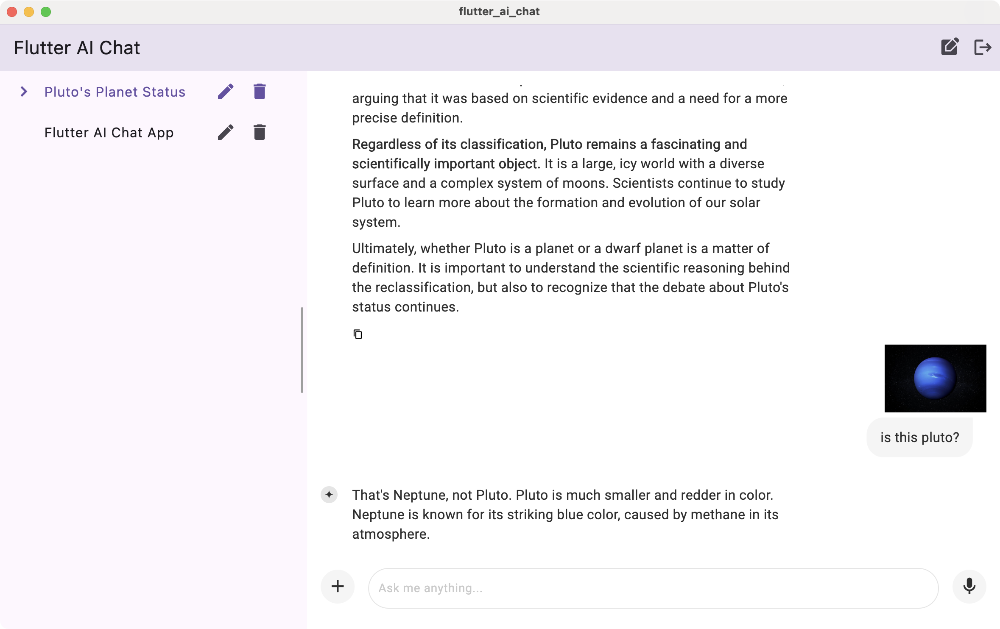
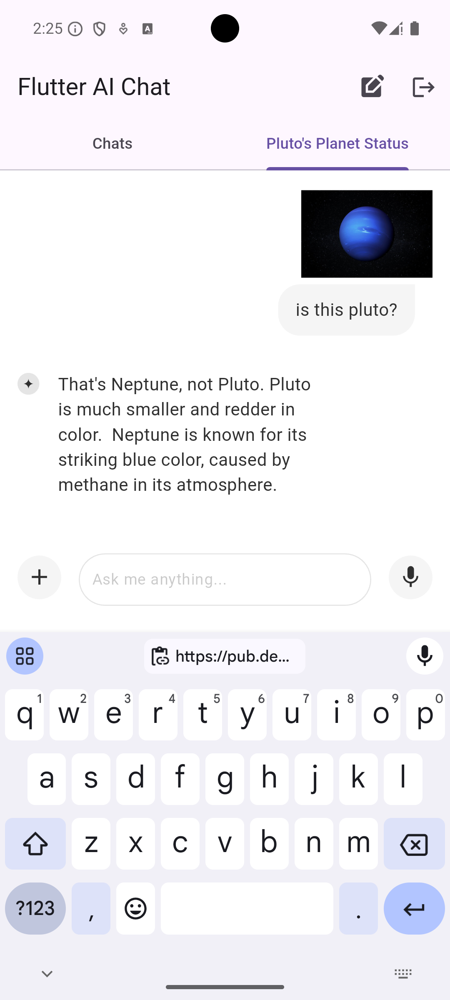

# Flutter AI Chat

Hello and welcome to the Flutter AI Chat sample app!

The AI Chat sample is meant to be a full-fledged chat app built using [the Flutter AI Toolkit](https://pub.dev/packages/flutter_ai_toolkit) and Vertex AI for Firebase. In addition to all of the multi-shot, multi-media, streaming features that it gets from the AI Toolkit, the AI Chat sample shows how to store and manage multiple chats at once in your own apps.

On desktop form-factors, the AI Chat sample looks like this:



On mobile form-factors, it looks like this:



The chats are stored in an authenticated Cloud Firestore database; any authenticated user can have as many chats as they like.

In addition, for each new chat, while the user can manually title it whatever they like, the initial prompt and response will be used to ask the LLM what an appropriate title should be. In fact, the titles of the chats in the screenshots above were set automatically.

# Getting Started

This sample relies on a Firebase project, which you then initialize in your app. You can learn how to set that up with the steps described in [the Get started with the Gemini API using the Vertex AI in Firebase SDKs docs](https://firebase.google.com/docs/vertex-ai/get-started?platform=flutter).

## Firebase Auth

Once you have your Firebase project in place, you'll need to [configure Firebase Auth with support for the Email auth provider](https://github.com/firebase/FirebaseUI-Flutter/blob/main/docs/firebase-ui-auth/providers/email.md) to enable your users to create new accounts and store their chats. The project has all of the necessary code, so it's just a matter of enabling the "Email/Password" provider in the [Firebase Console](https://console.firebase.google.com/project/_/authentication/providers).

## Cloud Firestore

And finally, you'll need to create the default Cloud Firestore database to store your users' chats. The [Create a Cloud Firestore database docs](https://firebase.google.com/docs/firestore/quickstart#create) will show you how to do that.

Once you have your database created, you can secure it according to [the Firebase Security Rules docs for Content-owner only access](https://firebase.google.com/docs/rules/basics#content-owner_only_access) using rules like these:

```
rules_version = '2';
service cloud.firestore {
  match /databases/{database}/documents {
    match /users/{userId}/{documents=**} {
      allow read, write: if request.auth != null && request.auth.uid == userId
    }
  }
}
```

## Firebase AppCheck

In addition, for maximum security, I recommend configuring your own apps with [Firebase AppCheck](https://firebase.google.com/learn/pathways/firebase-app-check).

# Feedback

Are you having trouble with this app even after it's been configured correctly? Feel free to drop issues or, even better, PRs, into [the flutter_ai_chat repo](https://github.com/csells/flutter_ai_chat).